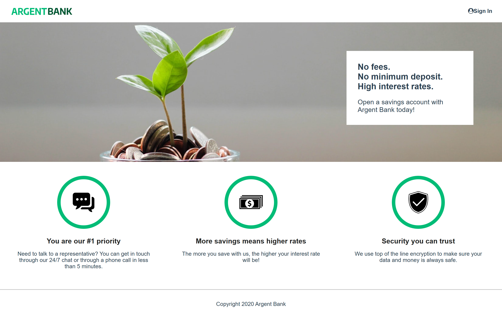
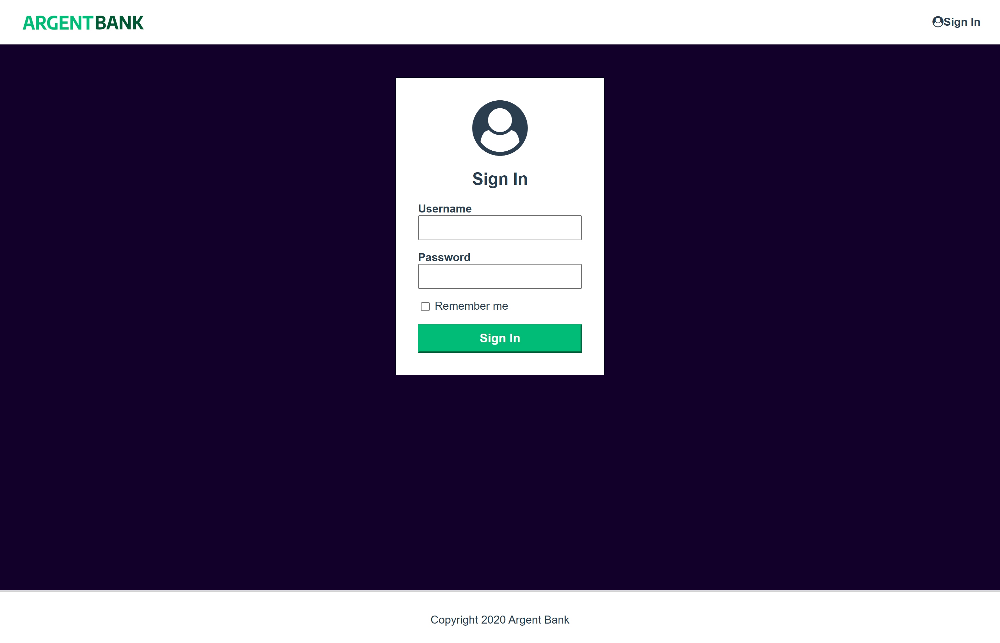
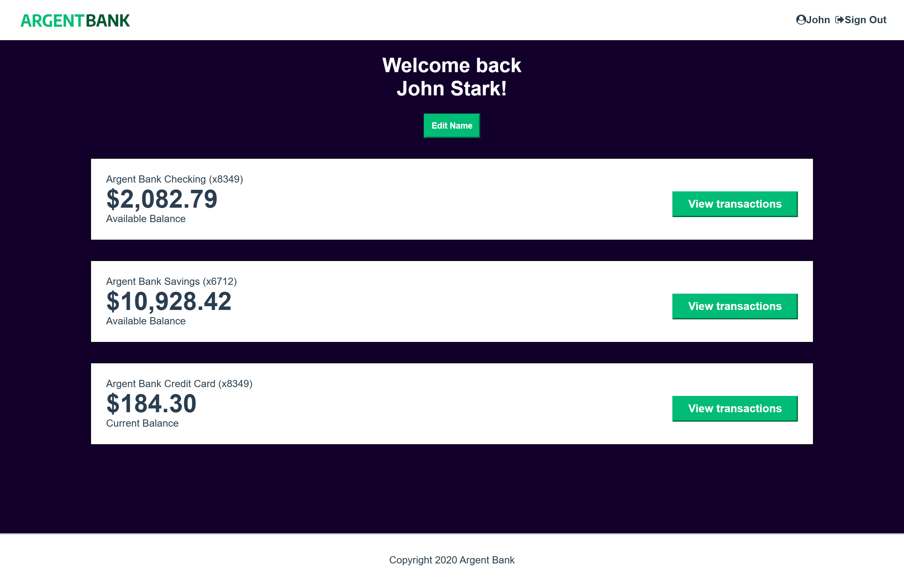
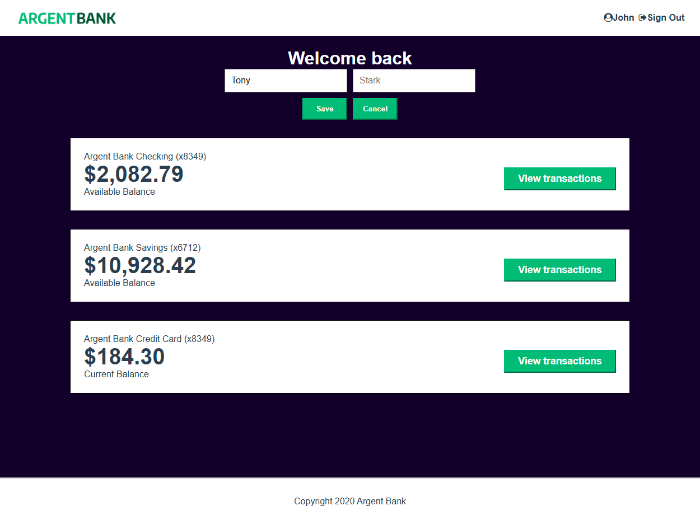

# Project #13 - Argent Bank

Code du projet 13 de la formation React d'OpenClassroom. \
J'ai utilisé SASS, TypeScript, React, Redux, React-Persist, Axios et Swagger.

## Pour le reproduire

### Pré-requis

- [Node.js v12](https://nodejs.org/en/)
- [MongoDB Community Server](https://www.mongodb.com/try/download/community)

Il faut installer et démarrer le backend depuis ce [repo GitHub](https://github.com/OpenClassrooms-Student-Center/Project-10-Bank-API)

### Instructions

1. Clonez ce repo sur votre ordinateur
1. Lancez votre terminal
1. Installez les dépendences : `npm install`
1. Démarrez le frontend : `npm run dev:front`
1. Lancez votre navigateur sur la page d'accueil : [http://localhost:4000](http://localhost:4000)

## Les utilisateurs par défaut

### Tony Stark

- First Name: `Tony`
- Last Name: `Stark`
- Email: `tony@stark.com`
- Password: `password123`

### Steve Rogers

- First Name: `Steve`,
- Last Name: `Rogers`,
- Email: `steve@rogers.com`,
- Password: `password456`

## Captures d'écran

### Page d'accueil

### Page de connexion

### Page d'utilisateur

### Edition du nom d'utilisateur

